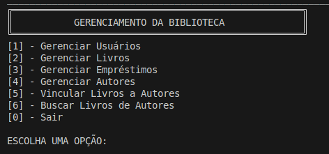
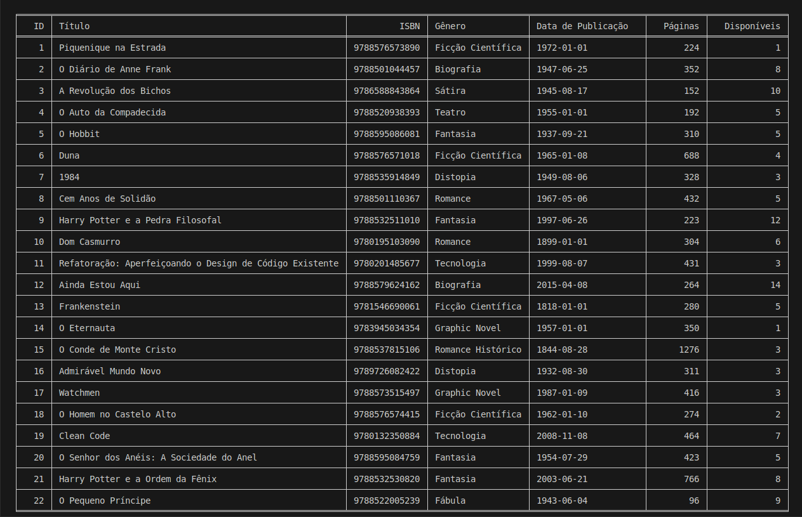
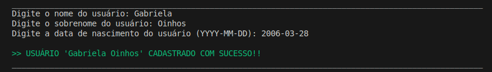
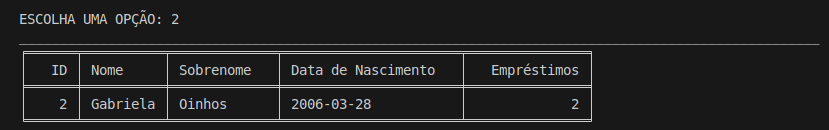
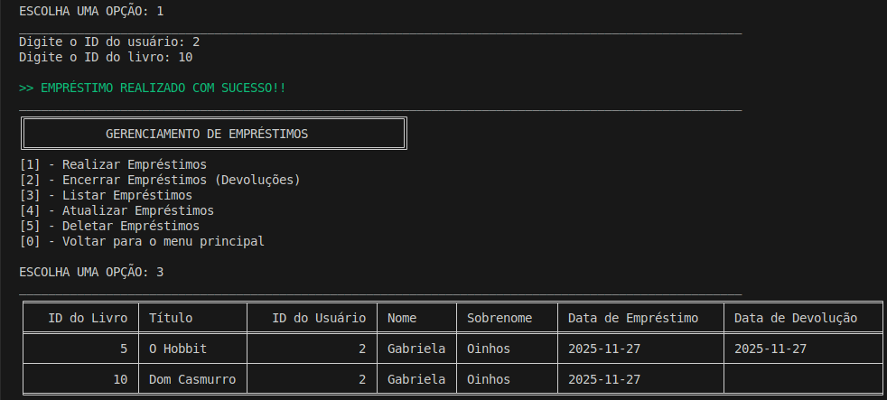

# Projeto - Biblioteca

Aplicação desenvolvida em Python com SQLite e web scraping, permitindo gerenciar autores, livros, usuários e empréstimos de forma simples e eficiente. Inclui CRUD completo, validações, modelagem de dados e automação para preencher o banco inicial com livros reais.

<p align="center">
  
  
  
  
  
</p>


---

## Funcionalidades Principais

- CRUD completo para autores, livros, usuários e empréstimos
- Controle de disponibilidade de livros
- Devolução e fechamento de empréstimos
- Validações robustas (ISBN, datas, strings e regras de negócio)
- Web scraping automático para gerar dados iniciais
- Integração livro ↔ autor
- Interface via terminal com Tabulate e cores
- Trigger que limita usuários a 5 empréstimos ativos
- Estrutura modular (banco, serviços, utilidades, menus)

---

## Prints do Sistema

### Menu Principal


### Listagem de Livros (Tabulate)


### Cadastro de Usuário



### Empréstimo Realizado


---

## Estrutura do Projeto

```bash
projeto_biblioteca/
│
├─ database/ # Acesso direto ao banco de dados (CRUD em nível de DB)
│ ├─ conectar_banco.py
│ ├─ crud_autores_db.py
│ ├─ crud_emprestimos_db.py
│ ├─ crud_livros_autores_db.py
│ ├─ crud_livros_db.py
│ └─ crud_usuarios_db.py
│
├─ servicos/ # Lógica de negócio + interação com o usuário
│ ├─ crud_autores.py
│ ├─ crud_emprestimos.py
│ ├─ crud_livros_autores.py
│ ├─ crud_livros.py
│ └─ crud_usuarios.py
│
├─ utils/ # Funções auxiliares
│ ├─ mensagens.py
│ └─ validacoes.py
│
├─ menus.py # Menus e interação principal
├─ scraping.py # Coleta livros da web e insere no banco
├─ criar_banco.py  # Gera a estrutura inicial do banco (tabelas + trigger)
├─ requirements.txt # Dependências do projeto
└─ README.md # Documentação

```
---

## Instalação das Dependências

1 . Crie um ambiente virtual (opcional, mas recomendado):

```bash
# Linux/macOS
python3 -m venv venv
source venv/bin/activate

# Windows
python -m venv venv
venv\Scripts\activate
```

2 . Instale as bibliotecas necessárias:

```
pip install -r requirements.txt
```

### Dependências principais:

- tabulate → exibir tabelas no terminal
- requests → web scraping
- beautifulsoup4 → web scraping
- pandas → manipulação de dados
- lxml → parser HTML/XML

O SQLite já vem com Python, não precisa instalar.

---

## Fluxo de Execução

1 . Criar o banco SQLite vazio:

```
python criar_banco.py
```

2 . Popular o banco com dados do web scraping:

```
python scraping.py
```

3 . Usar o CRUD via menus:

```
python menus.py
```

Internamente, todos os CRUDs já gerenciam a conexão com o banco (conectar_banco.py). Não é necessário conectar ou desconectar manualmente.

---

## Observações

- O arquivo biblioteca.db é criado automaticamente.
- O projeto é voltado para fins educacionais e de aprendizado.
- Toda manipulação de dados deve ser feita pelos menus interativos.
- A organização modular facilita a manutenção e futuras expansões.

---

## Licença

Este projeto está sob a licença MIT. Veja o arquivo LICENSE para mais detalhes.

---